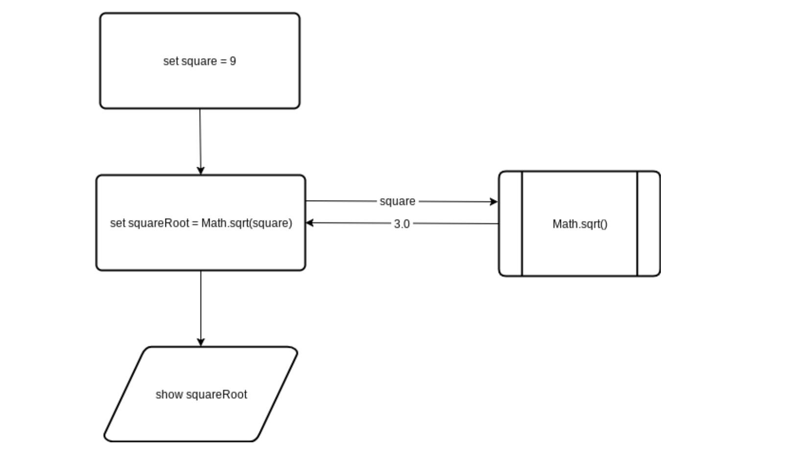
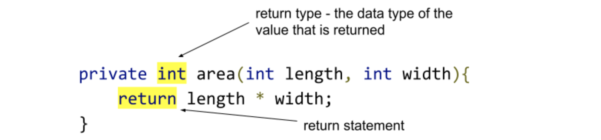

# 3.3 Methods with Return Values

## Getting Results from a Method
You’ve seen that parameter passing provides a mechanism for initializing the variables in a method.  In a way, parameters act as inputs to a method. We can call a method many times and get different  results by changing the input parameters.  Up to this point we've only defined methods that printed results to the screen, now let's take a look at methods that output information by returning values back to the calling program.

Consider our usage of the `Math.sqrt()` method.  When we call it, it processes and **returns** a value back to the program.

```java
double square = 9.0;
double squareRoot = Math.sqrt(square);
System.out.println(squareRoot)
```



Considering this, what is the sequence of operations for assigning a value to squareRoot in statement above:
1. Control in the calling program pauses.
2. Actual parameters (square) is passed to the method.
3. Body of sqrt method  is executed.
4. Returns to the calling program (results of square root method  passed to calling program).  

## Defining a method with a return value

Define a method area that returns the area of a rectangle given the length and width parameters (integers)
```java
private int area(int length, int width){
    return length * width;
}
```



## The return type

* Indicated in the method header before the method name
* Data type of the value that is returned
* If a method has no return statement, the return type is `void`
```java
private void area(int length, int width){
    System.out.println(length*width);  
}
```

## The `return` statement

* Indicates the value (can be the result of an expression) that the method returns.
* A method can have multiple return statements
* Once a return statement is executed, the execution of the method is complete.

### Example

1. Write a method `combineStr` that returns the combination of two string parameters string1 and string2.   

#### Sample call
`combineStr("hello", "world")` → `"helloworld"`

2. Write a program (a `run()` method) that tests out your `combineStr` method

```java
public class MyProgram extends ConsoleProgram {
  public void run() {
    String result = combineStr("hello", "world");
    System.out.println(result);
  }

  private String combineStr(String string1, String string2) {
    return string1 + string2;
  }
}
```